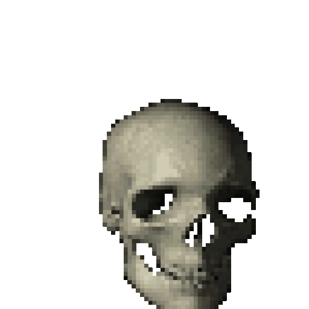

# Zombie Survivors

### Description

The classic experience of Vampire Survivors remade in a SFML uni project. Survive hoards of enemies that scale as time goes by leveling and unlocking items. As time passes the enemies will get stronger and stronger and you must keep up the pace. Items can synergise to create stronger versions of themselves. You don't have to worry about aiming since all weapons autofire.

### Controls
- W,A,S,D to move
- Left Click and hold to also move into a direction
- F to enter or exit fullscreen mode
- ESC key to exit the game

### Planned features:
- [x] Three selectable characters to play, each with their own starting weapon and stats
- [x] Main Menu, pause, death screen and game state
- [x] At least an inventory space for 3 weapons and 3 items
- [x] At least 3 weapons
- [x] Mouse input movement (alongside WASD like in the OG game)
- [x] World Border

### Tips & Tricks:
- The movement generated by the mouse and WASD keys are stackable, use them to gain a distance advantage
- Circling around a horde of enemies is an easy way to slowly grind them down
- Health regen is OP, aim to level it up
- The flying skull character is OP, try to unlock it by killing five flying skulls

### Meet your heroes...
1. **Hocus**

* Graduating from the wizarding school of Evermore with high honors and earning a PhD in Applied Fireball Sciences, Hocus has focused on demonstrating his degree on the battlefield. His current research is on the topic of curing Zombification by fire.

2. **Azoth**
   
* Nobody knows who Azoth was before his demonic ascension, but his rather old fashion style gives away the century he was born in. Hates zombies because they do not submit to his will.

3. **Badass flying skull**
   
* A mysterious cool skull that has turned against its brothers.


## Instrucțiuni de compilare

Proiectul este configurat cu CMake.

Instrucțiuni pentru terminal:

0. Biblioteci necesare pe Linux (presupunem sistem de operare bazat pe Debian, necesită `sudo`)
```sh
bash ./scripts/install-sfml-deps.sh
```

Dacă lipsesc și alte biblioteci, ștergeți folder-ul de build de la pasul 1 și reconfigurați proiectul după ce ați instalat ce lipsea.

1. Pasul de configurare
```sh
cmake -S . -B build -DCMAKE_BUILD_TYPE=Debug
# sau ./scripts/cmake.sh configure
```

Sau pe Windows cu GCC folosind Git Bash:
```sh
cmake -S . -B build -DCMAKE_BUILD_TYPE=Debug -G Ninja
# sau ./scripts/cmake.sh configure -g Ninja
```

Pentru a configura cu ASan, avem opțiunea `-DUSE_ASAN=ON` (nu merge pe Windows cu GCC):
```sh
cmake -S . -B build -DCMAKE_BUILD_TYPE=Debug -DUSE_ASAN=ON
# sau ./scripts/cmake.sh configure -e "-DUSE_ASAN=ON"
```


La acest pas putem cere să generăm fișiere de proiect pentru diverse medii de lucru.


2. Pasul de compilare
```sh
cmake --build build --config Debug --parallel 6
# sau ./scripts/cmake.sh build
```

Cu opțiunea `parallel` specificăm numărul de fișiere compilate în paralel.


3. Pasul de instalare (opțional)
```sh
cmake --install build --config Debug --prefix install_dir
# sau ./scripts/cmake.sh install
```

Vezi și [`scripts/cmake.sh`](scripts/cmake.sh).

Observație: folderele `build/` și `install_dir/` sunt adăugate în fișierul `.gitignore` deoarece
conțin fișiere generate și nu ne ajută să le versionăm.


## Instrucțiuni pentru a rula executabilul

Există mai multe variante:

1. Din directorul de build (implicit `build`). Executabilul se află la locația `./build/oop` după ce a fost rulat pasul de compilare al proiectului (`./scripts/cmake.sh build` - pasul 2 de mai sus).

```sh
./build/oop
```

2. Din directorul `install_dir`. Executabilul se află la locația `./install_dir/bin/oop` după ce a fost rulat pasul de instalare (`./scripts/cmake.sh install` - pasul 3 de mai sus).

```sh
./install_dir/bin/oop
```

3. Rularea programului folosind Valgrind se poate face executând script-ul `./scripts/run_valgrind.sh` din rădăcina proiectului. Pe Windows acest script se poate rula folosind WSL (Windows Subsystem for Linux). Valgrind se poate rula în modul interactiv folosind: `RUN_INTERACTIVE=true ./scripts/run_valgrind.sh`

Implicit, nu se rulează interactiv, iar datele pentru `std::cin` sunt preluate din fișierul `tastatura.txt`.

```sh
RUN_INTERACTIVE=true ./scripts/run_valgrind.sh
# sau
./scripts/run_valgrind.sh
```

4. Pentru a rula executabilul folosind ASan, este nevoie ca la pasul de configurare (vezi mai sus) să fie activat acest sanitizer. Ar trebui să meargă pe macOS și Linux. Pentru Windows, ar merge doar cu MSVC (nerecomandat).

Comanda este aceeași ca la pasul 1 sau 2. Nu merge combinat cu Valgrind.

```sh
./build/oop
# sau
./install_dir/bin/oop
```

## Resurse

Libraries
<!-- renovate: datasource=github-tags depName=SFML/SFML versioning=loose -->
- [SFML](https://github.com/SFML/SFML/tree/3.0.2) (Zlib)
- [json](https://github.com/nlohmann/json) by [nlohmann](https://github.com/nlohmann)

All assets have been made by me using [Paint.net](https://www.getpaint.net/) :D except:
- [Spinning Skull Gif](https://tenor.com/view/skull-skullgif-gif-24419301) by Unknown (its a viral meme i can not find the original creator)
- [Backgound Castle Image](https://ro.wikipedia.org/wiki/Fi%C8%99ier:01_Chateau_Peles.jpg) by Wikipedia User [Myrabella](https://commons.wikimedia.org/wiki/User:Myrabella)
- [game_over.ttf font](https://www.dafont.com/game-over.font)
